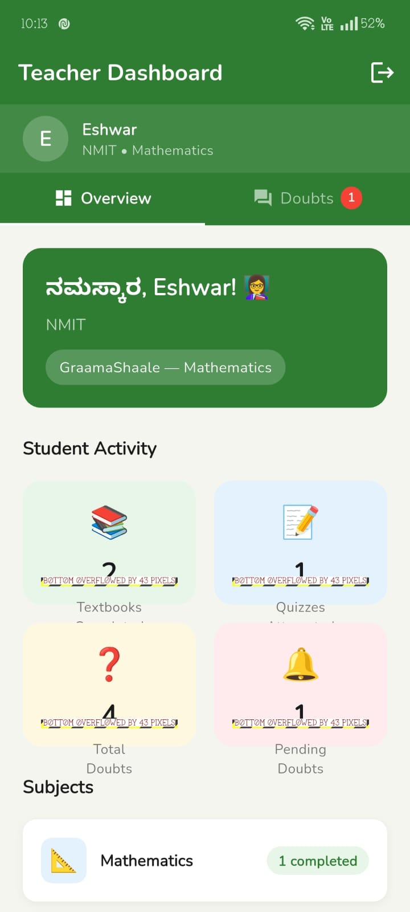
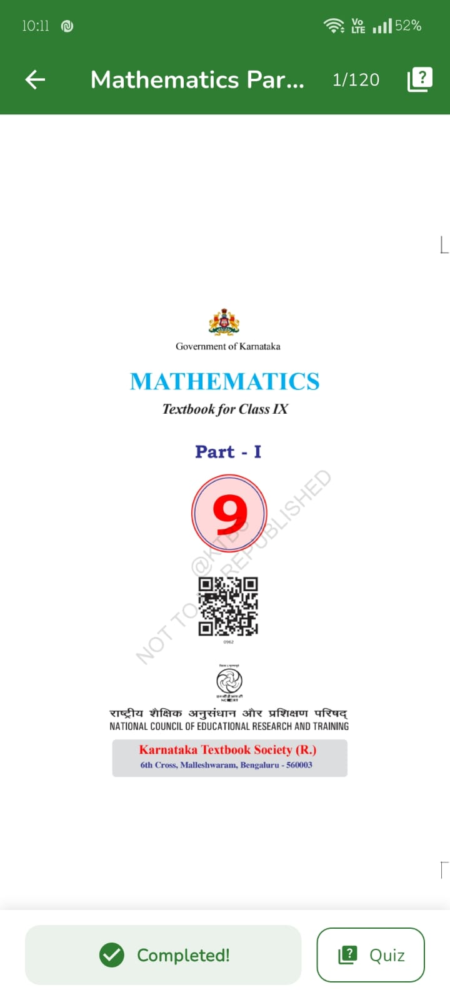

# ಗ್ರಾಮಶಾಲೆ — GraamaShaale 📚


> **Learn from anywhere, anytime.**
> ಕಲಿಕೆ, ಎಲ್ಲಿಂದಲೂ. ಯಾವಾಗಲೂ.

An offline-first hybrid mobile educational application for rural high school students in Karnataka, India — built with Flutter.

---

## 📱 About

GraamaShaale (meaning "Village School" in Kannada) is designed to bridge the digital education divide in rural Karnataka. Students in Classes 8, 9, and 10 can access complete KSEEB-aligned textbooks, practice bilingual quizzes, track their progress, and ask doubts — **all without an internet connection**.

---

## ✨ Features

### 👨‍🎓 For Students
- 📖 **Offline Textbooks** — Download KSEEB textbooks once, read forever offline
- 🔤 **Bilingual Support** — Content in both Kannada and English medium
- 📝 **MCQ Quizzes** — Bilingual practice questions with instant feedback
- 📊 **Progress Tracking** — Track completed textbooks and quiz scores
- ❓ **Doubt Corner** — Submit doubts offline, synced to teacher when online
- 👤 **Student Profile** — Unique Student ID, class, medium details

### 👩‍🏫 For Teachers
- 📋 **Teacher Dashboard** — View student activity and statistics
- 💬 **Answer Doubts** — Reply to student doubts filtered by subject
- 🏫 **School Registration** — Register with name, school, and subject
- 🔔 **Pending Alerts** — Badge count for unanswered doubts

### 🔌 Offline-First Architecture
- Works **100% offline** after initial content download
- Auto-syncs doubts to Firebase when internet is available
- Red banner indicator shows offline/online status
- Pull-to-refresh on all screens

---

## 📸 Screenshots

<table align="center">
<tr>
<td align="center">
<b>Login Screen</b><br><br>

</td>

<td align="center">
<b>Home Screen</b><br><br>

</td>
</tr>

<tr>
<td align="center">
<b>Quiz Screen</b><br><br>

</td>

<td align="center">
<b>Teacher Dashboard</b><br><br>

</td>
</tr>

<tr>
<td align="center">
<b>Progress Screen</b><br><br>

</td>

<td align="center">
<b>PDF Viewer</b><br><br>

</td>
</tr>
</table>


## 🏗️ Tech Stack

| Category | Technology |
|---|---|
| Framework | Flutter (Dart) |
| Local Database | SQLite via `sqflite` |
| Key-Value Store | `hive_flutter` |
| State Management | `flutter_riverpod` |
| Cloud Backend | Firebase Firestore |
| Content Delivery | GitHub Releases (KSEEB PDFs) |
| PDF Viewer | `flutter_pdfview` |
| File Download | `dio` |
| Connectivity | `connectivity_plus` |
| UI | Material Design 3 |

---

## 📂 Project Structure
```text
lib/
├── app/
│   ├── app.dart
│   └── main_screen.dart
├── core/
│   ├── database/
│   │   ├── database_helper.dart
│   │   ├── database_repository.dart
│   │   ├── lesson_model.dart
│   │   ├── question_model.dart
│   │   ├── progress_model.dart
│   │   └── doubt_model.dart
│   ├── sync/
│   │   ├── sync_service.dart
│   │   └── download_service.dart
│   └── theme/
│       └── app_theme.dart
└── features/
├── lessons/
│   └── screens/
│       ├── splash_screen.dart
│       ├── login_screen.dart
│       ├── home_screen.dart
│       ├── lessons_screen.dart
│       ├── pdf_viewer_screen.dart
│       ├── teacher_home_screen.dart
│       └── teacher_register_screen.dart
├── practice/
│   └── screens/
│       ├── quiz_screen.dart
│       └── score_screen.dart
├── progress/
│   └── screens/
│       ├── progress_screen.dart
│       └── profile_screen.dart
└── doubt/
└── screens/
└── doubt_screen.dart
```
---

## 🚀 Getting Started

### Prerequisites
- Flutter SDK >= 3.0.0
- Android Studio or VS Code
- Android device or emulator (Android 5.0+)
- Firebase project with Firestore enabled

### Installation

**1. Clone the repository**
```bash
git clone https://github.com/Eshwarmp/Graamashaale.git
cd Graamashaale
```

**2. Install dependencies**
```bash
flutter pub get
```

**3. Add Firebase configuration**
- Download `google-services.json` from your Firebase console
- Place it in `android/app/`

**4. Run the app**
```bash
flutter run
```

### Build Release APK
```bash
flutter build apk --release --split-per-abi
```
The optimized APK for modern phones will be at:
build/app/outputs/flutter-apk/app-arm64-v8a-release.apk

---

## 📚 KSEEB Content

Textbooks are hosted on GitHub Releases and downloaded on-demand.
All 36 textbooks are available for:

| Class | Core Subjects | Language Subjects |
|---|---|---|
| Class 8 | Mathematics, Science, Social Studies | English, Kannada, Hindi |
| Class 9 | Mathematics, Science, Social Studies | English, Kannada, Hindi |
| Class 10 | Mathematics, Science, Social Studies | English, Kannada, Hindi |

- **English Medium** — English version of core subject textbooks
- **Kannada Medium** — Kannada version of core subject textbooks
- **Language subjects** — Same for both mediums

---

## 🗄️ Database Schema

```sql
lessons     — Lesson metadata and PDF paths
questions   — Bilingual MCQ questions
progress    — Student quiz scores and completion
doubts      — Student doubts with teacher answers
```

---

## 🔄 Offline Sync Flow
```text
Student submits doubt
↓
Saved to SQLite locally (works offline ✅)
↓
Internet available?
YES → Push to Firebase Firestore
NO  → Wait and retry automatically
↓
Teacher sees doubt in dashboard
↓
Teacher sends answer
↓
Student sees answer on pull-to-refresh
```

## 📄 License

This project was developed as a Mini-Project for academic purposes under VTU.

---

## 🙏 Acknowledgements

- [Karnataka Textbook Society (KTBS)](https://ktbs.kar.nic.in) for free KSEEB textbooks
- [Flutter](https://flutter.dev) for the cross-platform framework
- [Firebase](https://firebase.google.com) for cloud backend
- [VTU](https://vtu.ac.in) and [NMIT](https://nmit.ac.in) for academic support